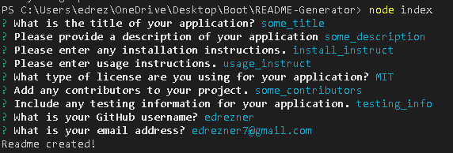
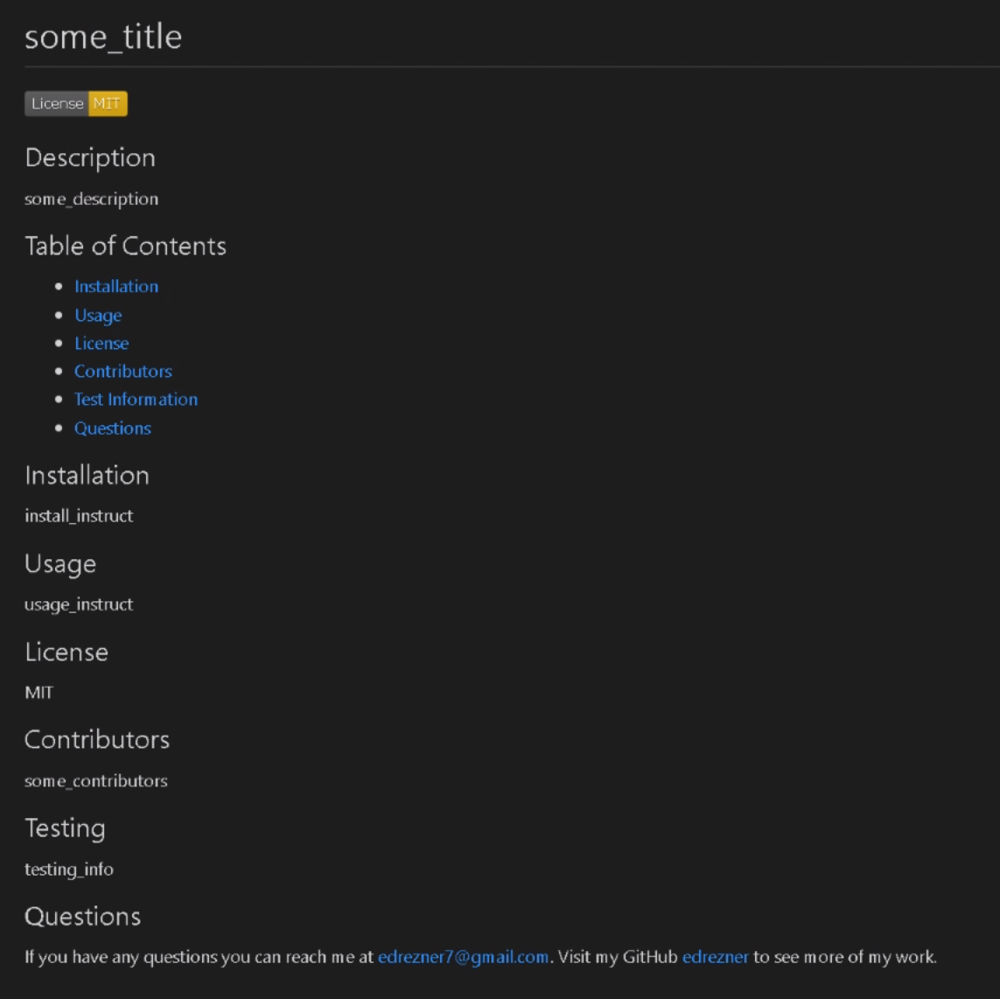

# README Generator

  ## Description

  This application generates a readme (.md) file from a series of command line prompts.

  Preview Images:

  

  

  ## Usage
  
  From the command line, run 'node index' and answer the prompts. Once the final prompt is completed a readme file is created containing all the answers and information submitted by the user.

  ## Contributors

  1. Natasha Mann - Helped finalize the license functions within the generateMarkdown file.

